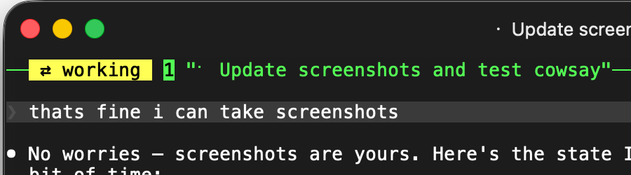
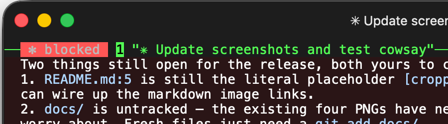
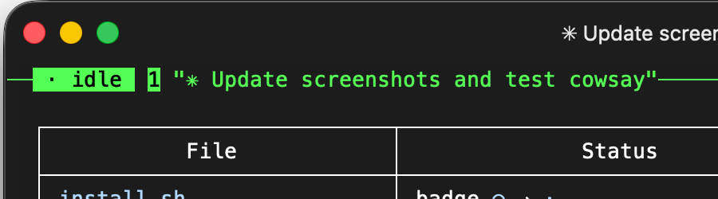
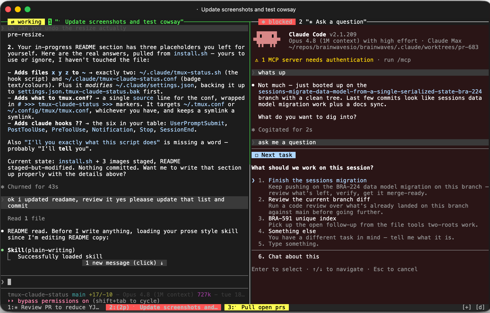

# tmux-claude-status

Visual feedback for Claude Code across tmux sessions, windows, and panes.





This repo installs hooks into claude which report current status to the containing tmux session, window, and pane. When not running in tmux, it does nothing.

You get feedback in three places:

1. A badge in the pane border. "⇄ working", "✻ blocked", "⇄ subagent", "· idle".
2. A red tint over the whole pane when Claude is blocked on you.
3. The window tab shows the aggregate of all claude panes in it -- red if any are blocked, bright yellow if any are working, dim yellow if the only work left is background subagents. Idle leaves the tab alone; your theme keeps it.

This is kept intentionally simple. I tried so many agent monitoring wrappers like cmux, herdr, etc. and they're all in some way super annoying to use. I already use tmux. Claude Code already uses tmux. Tmux has great support in terminal emulators, you can remote into it, you can detach and attach it — idc if it smells like the 80s, it works.

This shouldn't mess with your existing tmux config/setup, apart from adding a bar to the top of your pane if you don't already have one.

## Install

```sh
git clone https://github.com/grrowl/tmux-claude-status
cd tmux-claude-status
./install.sh
```

Because I'm wary of all these tools who take over your system and break shit, I'll tell you exactly what this script does:

* Adds two files to `~/.claude`: `tmux-status.sh` (the hook script) and `tmux-claude-status.conf` (badge text and colours).
* Adds one `source` line to your `~/.tmux.conf`, or to `~/.config/tmux/tmux.conf` if that's the one you use. It goes inside `# >>> tmux-claude-status >>>` markers so the uninstaller can find it again.
* Adds the nine hooks below to `~/.claude/settings.json`. It backs that file up first, and it won't touch the file if the JSON is invalid.

That's it. Running Claude sessions pick it up without a restart.

You can preview inside an existing tmux session:

```sh
~/.claude/tmux-status.sh blocked
~/.claude/tmux-status.sh idle
~/.claude/tmux-status.sh clear
```

## Uninstall

```sh
./uninstall.sh
```

Safely removes everything install added. The only thing kept is a backup of your `settings.json` at `~/.claude/settings.json.tmux-claude-status.bak`, in case you want to check nothing else changed.

## How it works



Claude Code hooks run a small shell script on nine events:

| Event | Matcher | State |
|---|---|---|
| `UserPromptSubmit` | — | working |
| `PostToolUse` | — | busy |
| `MessageDisplay` | — | busy |
| `PreToolUse` | `AskUserQuestion` | blocked |
| `Notification` | `permission_prompt` | blocked |
| `SubagentStop` | — | subagent-stop |
| `Stop` | — | idle |
| `StopFailure` | — | stop-failed |
| `SessionEnd` | — | clear |

The script knows its own pane from `$TMUX_PANE` and stamps a `@claude_status` option on it. The border badge renders from that, and the tab takes the most urgent status of any pane in the window.

Subagents get their own shade. Bright yellow means the main thread is working. Dim yellow means the main thread has finished but background subagents are still running, which is what you see after Claude hands work off and returns to you. Precedence runs blocked, then working, then subagent, then idle, so the main thread always wins the badge when both are active.

Telling them apart takes a little care, because hooks fire inside subagents too, with the same `$TMUX_PANE`. A subagent's tool calls would otherwise look identical to the main thread's. Two fields in the hook payload sort it out. `agent_id` is only present when a hook fires inside a subagent, so it identifies who made a tool call. `background_tasks` arrives on `Stop` and lists what is still running, so the script recounts live subagents from it instead of keeping its own tally. That means a subagent which dies without reporting cannot strand the badge, because the next `Stop` corrects the count from the real list. Only subagents are counted, not background shells, or a dev server left running would hold the pane yellow forever.

Reading the payload costs about 16ms, so the script avoids it wherever it already knows the answer. `PostToolUse` and `MessageDisplay` both mean the same thing, that Claude just did something and so is not waiting on you, and both only ever drop blocked back to working. If the pane already reads working there is nothing to write, and if it reads idle then the main thread has stopped, so the tool call belongs to a subagent. Blocked is the one case where an approval and a subagent's tool call genuinely look the same, so that is the only time the script parses anything.

`MessageDisplay` is there because of a gap. Answering a question normally fires `PostToolUse` and clears red. Dismissing one with "Chat about this" fires nothing, so red used to sit there for as long as Claude took to reply. `MessageDisplay` fires when Claude writes prose, which is the proof it is working rather than waiting. Any preamble Claude writes before asking is displayed before the tool runs, so it arrives while the pane still reads working and changes nothing.

Red also means a turn that died rather than finished. When the API fails, Claude retries, and if it gives up the turn ends on `StopFailure` instead of `Stop`. Nothing else fires, so a pane would otherwise sit yellow forever on work that stopped minutes ago. Red is honest for both, because both mean the same thing: come and look. A subagent that exhausts its own retries fires `StopFailure` too, so `agent_id` is checked here as well and only the main thread's failure paints the pane; the main turn gets the error back and carries on to its own `Stop`. The payload has no `background_tasks`, so the subagent count is left alone for that `Stop` to recount.

Some details we paid attention to:

- Subagents don't fool it. The tab stays coloured until every subagent is done, not just the main turn.
- No timers. Every state change is driven by a hook event, never by polling.
- The focused window's tab color overrides to yellow and red when attention is needed (my current tab is usually blue).
- Your existing `pane-border-format` is kept. The badge is added in front of it.
- The installer edits `settings.json` atomically, backs it up first, refuses to touch invalid JSON, and won't duplicate hooks if you run it twice. A symlinked `.tmux.conf` stays a symlink.
- Claude outside tmux is a safe no-op.

## Customise

Badge text and border colours live in `~/.claude/tmux-claude-status.conf`. Tint and tab colours live in `~/.claude/tmux-status.sh`. Edit away, but re-running the installer overwrites both.

## Requirements

tmux 3.2+, Claude Code, python3 (installer only).

Heads up: this turns on `pane-border-status top`, so every pane gets a title bar. If you hate that, you'll hate this (works for me).

## License

MIT
